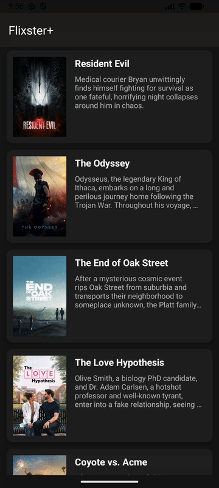

# Unit 3: Project 3 - Flixster+ Part 1

**Flixster+** is an Android application that allows users to browse current movies playing in theaters, viewing movie posters, titles, and descriptions using The Movie Database (TMDb) API.

## Required Features

The following **required** functionality is completed:

- [x] Make a request to The Movie Database API's now_playing endpoint to get a list of current movies.
- [x] Parse through JSON data using Gson and implement a RecyclerView to display all movie titles and descriptions.
- [x] Use Glide to load and display movie poster images with the correct base URL (`https://image.tmdb.org/t/p/w500/`).

## Stretch Features

The following **stretch** functionality is completed:

- [x] Improve and customize the user interface through styling and coloring (Cinematic dark theme, MaterialCardView, Toolbar header).
- [x] Implement orientation responsivity (Neatly arranges data in portrait mode with 1 column and landscape mode with 2 columns using GridLayoutManager).
- [x] Implement Glide to display custom placeholder graphics (`ic_movie_placeholder`) during image loading.

## Video Walkthrough

Here's a walkthrough of implemented features:

## Notes

- Built using Kotlin, AndroidX RecyclerView, Glide, Gson, and CodePath AsyncHttpClient.
